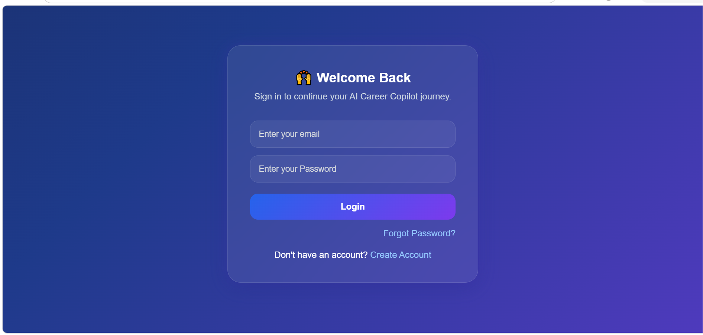
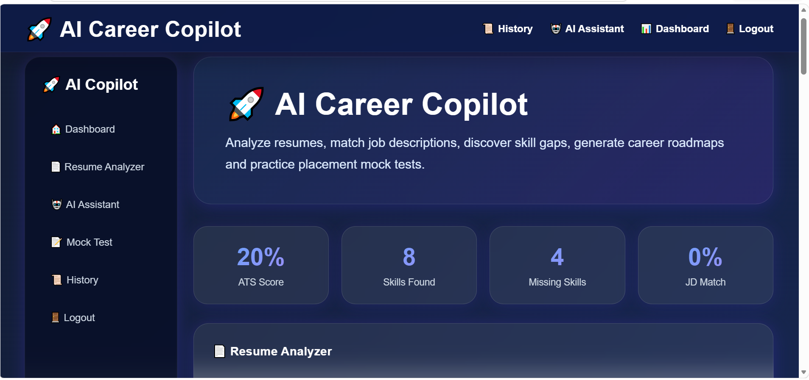

# 🚀 AI Career Copilot

An AI-powered career assistant that helps users analyze resumes, improve ATS scores, identify missing skills, match job descriptions, generate career roadmaps, and prepare for interviews.

# 📌 Project Overview

AI Career Copilot is a Flask-based web application designed for students, freshers, and job seekers. It provides AI-powered resume analysis, ATS score evaluation, skill gap detection, career guidance, interview preparation, and personalized recommendations.

Users can upload resumes in PDF, DOCX, or image formats and receive detailed insights to improve their chances of getting shortlisted by recruiters.

# ✨ Features

## 📄 Resume Analyzer

* ATS Score Calculation
* Resume Skill Extraction
* Missing Skills Detection
* Missing Keywords Detection
* Resume Improvement Tips

## 🎯 Job Description Matching

* Resume vs Job Description Comparison
* Match Score Percentage
* Skill Gap Analysis

## 🛤 Career Roadmap Generator

* Personalized Learning Roadmap
* Career Growth Suggestions
* Skill Development Guidance

## 🧠 Interview Preparation

* AI Generated Interview Questions
* Mock Test Module
* Placement Preparation Support

## 🤖 AI Career Assistant

* Resume Guidance
* Career Advice
* Placement Queries
* Skill Recommendations

## 📂 File Support

* PDF Resume Upload
* DOCX Resume Upload
* Image Resume Upload
* OCR Text Extraction

## 📑 Report Generation

* Download PDF Analysis Report

## 🔐 User Authentication

* Signup
* Login
* Logout
* Session Management

## 📜 History Tracking

* Store Previous Analyses
* Delete Individual Reports
* Delete Complete History

# 🛠 Tech Stack

## Frontend

* HTML5
* CSS3
* Jinja2 Templates

## Backend

* Python
* Flask

## Database

* SQLite
* SQLAlchemy

## AI Integration

* Groq API

## Libraries Used

* PyPDF2
* python-docx
* Pillow
* pytesseract
* reportlab
* python-dotenv

# 📷 Screenshots

## Login Page

## Signup Page

## Dashboard

## ATS Analysis Result

## AI Assistant

## Mock Test

# 📦 Installation

## Clone Repository

git clone https://github.com/shewalesakshi1983-cmd/AI-Career-Copilot.git

cd AI-Career-Copilot

## Create Virtual Environment

python -m venv venv

## Activate Virtual Environment

### Windows

venv\Scripts\activate

## Install Dependencies

pip install -r requirements.txt

## Create .env File
.env
SECRET_KEY=your_secret_key
GROQ_API_KEY=your_groq_api_key

## Run Application

python app.py

## Open Browser

http://127.0.0.1:5000

# 📁 Project Structure

AI-Career-Copilot/
│
├── screenshots/
├── static/
│   └── style.css
│
├── templates/
│   ├── base.html
│   ├── login.html
│   ├── signup.html
│   ├── dashboard.html
│   ├── history.html
│   ├── chatbot.html
│   ├── mock_test.html
│   └── forgot_password.html
│
├── app.py
├── ai.py
├── requirements.txt
├── README.md
├── .env
└── .gitignore

# 🔮 Future Enhancements

* AI Resume Builder
* LinkedIn Profile Analyzer
* Live Interview Simulator
* Job Recommendation Engine
* Multi-Language Support
* Cloud Deployment

# 👩‍💻 Author

**Sakshi Shewale**

GitHub:
https://github.com/shewalesakshi1983-cmd

# ⭐ Support

If you found this project useful, please consider giving it a star on GitHub.
 